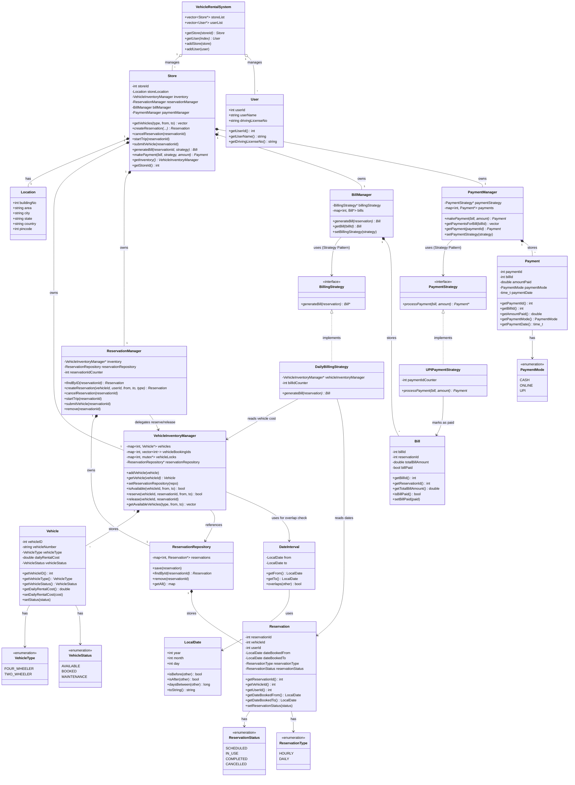

# Car Rental System - Class Diagram

```mermaid
classDiagram
    direction TB

    %% ============================================
    %% ENUMS
    %% ============================================

    class VehicleType {
        <<enumeration>>
        FOUR_WHEELER
        TWO_WHEELER
    }

    class VehicleStatus {
        <<enumeration>>
        AVAILABLE
        BOOKED
        MAINTENANCE
    }

    class ReservationStatus {
        <<enumeration>>
        SCHEDULED
        IN_USE
        COMPLETED
        CANCELLED
    }

    class ReservationType {
        <<enumeration>>
        HOURLY
        DAILY
    }

    class PaymentMode {
        <<enumeration>>
        CASH
        ONLINE
        UPI
    }

    %% ============================================
    %% PRODUCT LAYER
    %% ============================================

    class LocalDate {
        +int year
        +int month
        +int day
        +isBefore(other) bool
        +isAfter(other) bool
        +daysBetween(other) long
        +toString() string
    }

    class DateInterval {
        -LocalDate from
        -LocalDate to
        +getFrom() LocalDate
        +getTo() LocalDate
        +overlaps(other) bool
    }

    class Vehicle {
        -int vehicleID
        -string vehicleNumber
        -VehicleType vehicleType
        -double dailyRentalCost
        -VehicleStatus vehicleStatus
        +getVehicleID() int
        +getVehicleType() VehicleType
        +getVehicleStatus() VehicleStatus
        +getDailyRentalCost() double
        +setDailyRentalCost(cost)
        +setStatus(status)
    }

    class VehicleInventoryManager {
        -map~int, Vehicle*~ vehicles
        -map~int, vector~int~~ vehicleBookingIds
        -map~int, mutex*~ vehicleLocks
        -ReservationRepository* reservationRepository
        +addVehicle(vehicle)
        +getVehicle(vehicleId) Vehicle*
        +setReservationRepository(repo)
        +isAvailable(vehicleId, from, to) bool
        +reserve(vehicleId, reservationId, from, to) bool
        +release(vehicleId, reservationId)
        +getAvailableVehicles(type, from, to) vector
    }

    %% ============================================
    %% RESERVATION LAYER
    %% ============================================

    class Reservation {
        -int reservationId
        -int vehicleId
        -int userId
        -LocalDate dateBookedFrom
        -LocalDate dateBookedTo
        -ReservationType reservationType
        -ReservationStatus reservationStatus
        +getReservationId() int
        +getVehicleId() int
        +getUserId() int
        +getDateBookedFrom() LocalDate
        +getDateBookedTo() LocalDate
        +setReservationStatus(status)
    }

    class ReservationRepository {
        -map~int, Reservation*~ reservations
        +save(reservation)
        +findById(reservationId) Reservation*
        +remove(reservationId)
        +getAll() map
    }

    class ReservationManager {
        -VehicleInventoryManager* inventory
        -ReservationRepository reservationRepository
        -int reservationIdCounter
        +findByID(reservationId) Reservation*
        +createReservation(vehicleId, userId, from, to, type) Reservation*
        +cancelReservation(reservationId)
        +startTrip(reservationId)
        +submitVehicle(reservationId)
        +remove(reservationId)
    }

    %% ============================================
    %% BILLING LAYER
    %% ============================================

    class Bill {
        -int billId
        -int reservationId
        -double totalBillAmount
        -bool billPaid
        +getBillId() int
        +getReservationId() int
        +getTotalBillAmount() double
        +isBillPaid() bool
        +setBillPaid(paid)
    }

    class BillingStrategy {
        <<interface>>
        +generateBill(reservation)* Bill*
    }

    class DailyBillingStrategy {
        -VehicleInventoryManager* vehicleInventoryManager
        -int billIdCounter
        +generateBill(reservation) Bill*
    }

    class BillManager {
        -BillingStrategy* billingStrategy
        -map~int, Bill*~ bills
        +generateBill(reservation) Bill*
        +getBill(billId) Bill*
        +setBillingStrategy(strategy)
    }

    %% ============================================
    %% PAYMENT LAYER
    %% ============================================

    class Payment {
        -int paymentId
        -int billId
        -double amountPaid
        -PaymentMode paymentMode
        -time_t paymentDate
        +getPaymentId() int
        +getBillId() int
        +getAmountPaid() double
        +getPaymentMode() PaymentMode
        +getPaymentDate() time_t
    }

    class PaymentStrategy {
        <<interface>>
        +processPayment(bill, amount)* Payment*
    }

    class UPIPaymentStrategy {
        -int paymentIdCounter
        +processPayment(bill, amount) Payment*
    }

    class PaymentManager {
        -PaymentStrategy* paymentStrategy
        -map~int, Payment*~ payments
        +makePayment(bill, amount) Payment*
        +getPaymentsForBill(billId) vector
        +getPayment(paymentId) Payment*
        +setPaymentStrategy(strategy)
    }

    %% ============================================
    %% CORE / ROOT LAYER
    %% ============================================

    class Location {
        +int buildingNo
        +string area
        +string city
        +string state
        +string country
        +int pincode
    }

    class User {
        +int userId
        +string userName
        +string drivingLicenseNo
        +getUserId() int
        +getUserName() string
        +getDrivingLicenseNo() string
    }

    class Store {
        -int storeId
        -Location storeLocation
        -VehicleInventoryManager inventory
        -ReservationManager reservationManager
        -BillManager billManager
        -PaymentManager paymentManager
        +getVehicles(type, from, to) vector
        +createReservation(...) Reservation*
        +cancelReservation(reservationId)
        +startTrip(reservationId)
        +submitVehicle(reservationId)
        +generateBill(reservationId, strategy) Bill*
        +makePayment(bill, strategy, amount) Payment*
        +getInventory() VehicleInventoryManager*
        +getStoreId() int
    }

    class VehicleRentalSystem {
        +vector~Store*~ storeList
        +vector~User*~ userList
        +getStore(storeId) Store*
        +getUser(index) User*
        +addStore(store)
        +addUser(user)
    }

    %% ============================================
    %% RELATIONSHIPS
    %% ============================================

    Vehicle --> VehicleType : has
    Vehicle --> VehicleStatus : has
    Reservation --> ReservationStatus : has
    Reservation --> ReservationType : has
    Payment --> PaymentMode : has
    DateInterval --> LocalDate : uses

    VehicleInventoryManager "1" *-- "*" Vehicle : stores
    VehicleInventoryManager --> ReservationRepository : references
    VehicleInventoryManager --> DateInterval : uses for overlap check

    ReservationRepository "1" *-- "*" Reservation : stores
    ReservationManager "1" *-- "1" ReservationRepository : owns
    ReservationManager --> VehicleInventoryManager : delegates reserve/release

    BillingStrategy <|.. DailyBillingStrategy : implements
    DailyBillingStrategy --> VehicleInventoryManager : reads vehicle cost
    DailyBillingStrategy --> Reservation : reads dates
    BillManager --> BillingStrategy : uses (Strategy Pattern)
    BillManager "1" *-- "*" Bill : stores

    PaymentStrategy <|.. UPIPaymentStrategy : implements
    PaymentManager --> PaymentStrategy : uses (Strategy Pattern)
    PaymentManager "1" *-- "*" Payment : stores
    UPIPaymentStrategy --> Bill : marks as paid

    Store "1" *-- "1" Location : has
    Store "1" *-- "1" VehicleInventoryManager : owns
    Store "1" *-- "1" ReservationManager : owns
    Store "1" *-- "1" BillManager : owns
    Store "1" *-- "1" PaymentManager : owns

    VehicleRentalSystem "1" o-- "*" Store : manages
    VehicleRentalSystem "1" o-- "*" User : manages
```
