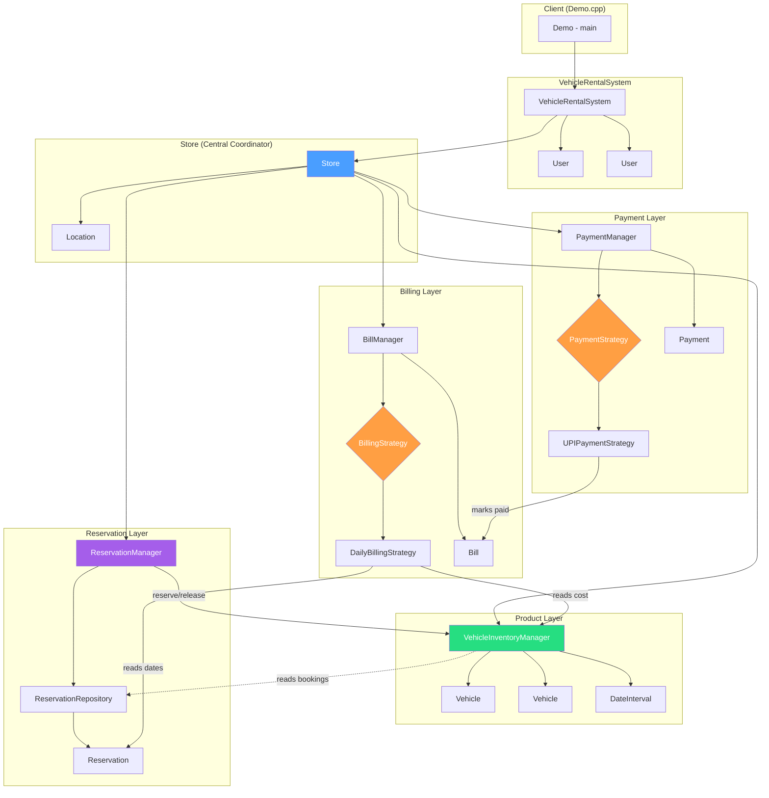

# Car Rental System - Component Overview

## High-Level Architecture



## Who Owns What

```
VehicleRentalSystem
├── stores: vector<Store*>          (manages all stores)
└── users: vector<User*>            (manages all users)

Store (Central Coordinator)
├── storeLocation: Location
├── inventory: VehicleInventoryManager
│   ├── vehicles: map<vehicleId, Vehicle*>
│   ├── vehicleBookingIds: map<vehicleId, vector<reservationId>>
│   └── vehicleLocks: map<vehicleId, mutex*>     (thread safety)
│
├── reservationManager: ReservationManager
│   └── reservationRepository: ReservationRepository
│       └── reservations: map<reservationId, Reservation*>
│
├── billManager: BillManager
│   ├── billingStrategy: BillingStrategy*         (Strategy Pattern)
│   └── bills: map<billId, Bill*>
│
└── paymentManager: PaymentManager
    ├── paymentStrategy: PaymentStrategy*         (Strategy Pattern)
    └── payments: map<paymentId, Payment*>
```

## Design Patterns Used

| Pattern               | Where                                      | Purpose                                        |
|-----------------------|--------------------------------------------|-------------------------------------------------|
| **Strategy**          | BillingStrategy / PaymentStrategy          | Swap billing & payment algorithms at runtime    |
| **Repository**        | ReservationRepository                      | Abstracts data storage for reservations         |
| **Manager / Service** | ReservationManager, BillManager, PaymentManager | Business logic separated from data objects  |
| **Composition**       | Store owns all managers                    | Store is the central coordinator                |

## Data Flow Summary

```
SEARCH:   Client -> Store -> VehicleInventoryManager -> (checks DateInterval overlaps) -> returns available vehicles

CREATE:   Client -> Store -> ReservationManager -> VehicleInventoryManager.reserve() [with mutex lock]
                                                -> ReservationRepository.save()

TRIP:     Client -> Store -> ReservationManager -> ReservationRepository.findById()
                                                -> reservation.setStatus(IN_USE / COMPLETED)
                                                -> VehicleInventoryManager.release() [with mutex lock]

BILLING:  Client -> Store -> BillManager -> DailyBillingStrategy
                                            -> reads Reservation (dates)
                                            -> reads Vehicle (daily cost)
                                            -> calculates: days * rate
                                            -> returns Bill

PAYMENT:  Client -> Store -> PaymentManager -> UPIPaymentStrategy
                                               -> creates Payment
                                               -> marks Bill as paid
                          -> ReservationManager.remove() (cleanup)
```

## Thread Safety Points

```
VehicleInventoryManager:
  - Per-vehicle mutex lock in reserve()     -> prevents double-booking same vehicle
  - Per-vehicle mutex lock in release()     -> safe concurrent release
  - Per-vehicle mutex lock in hasFreeSpot() -> consistent read

All other classes are single-threaded in the demo,
but the inventory layer is designed for concurrent access.
```
