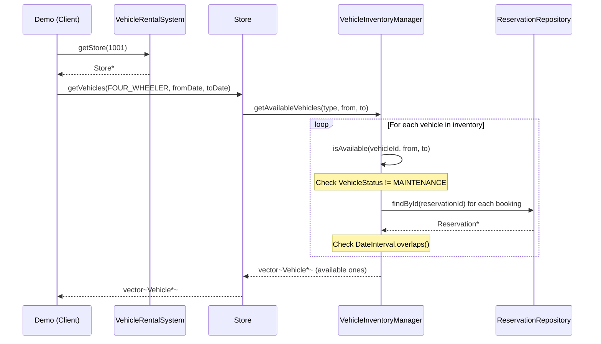
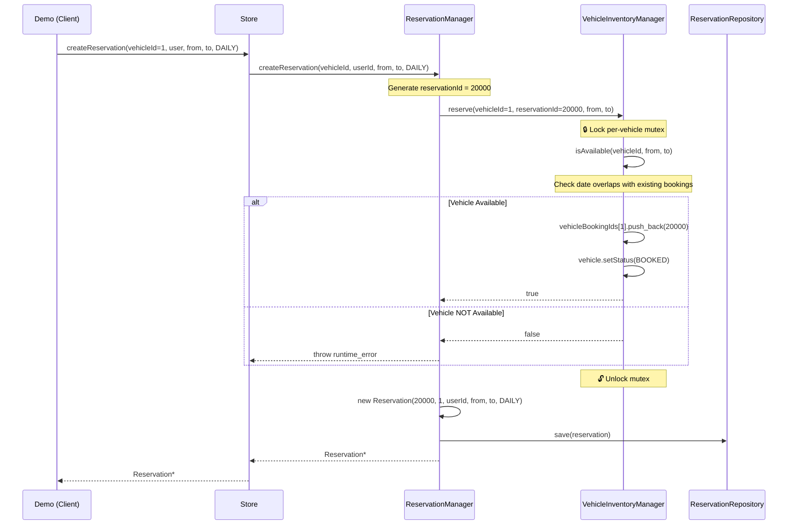
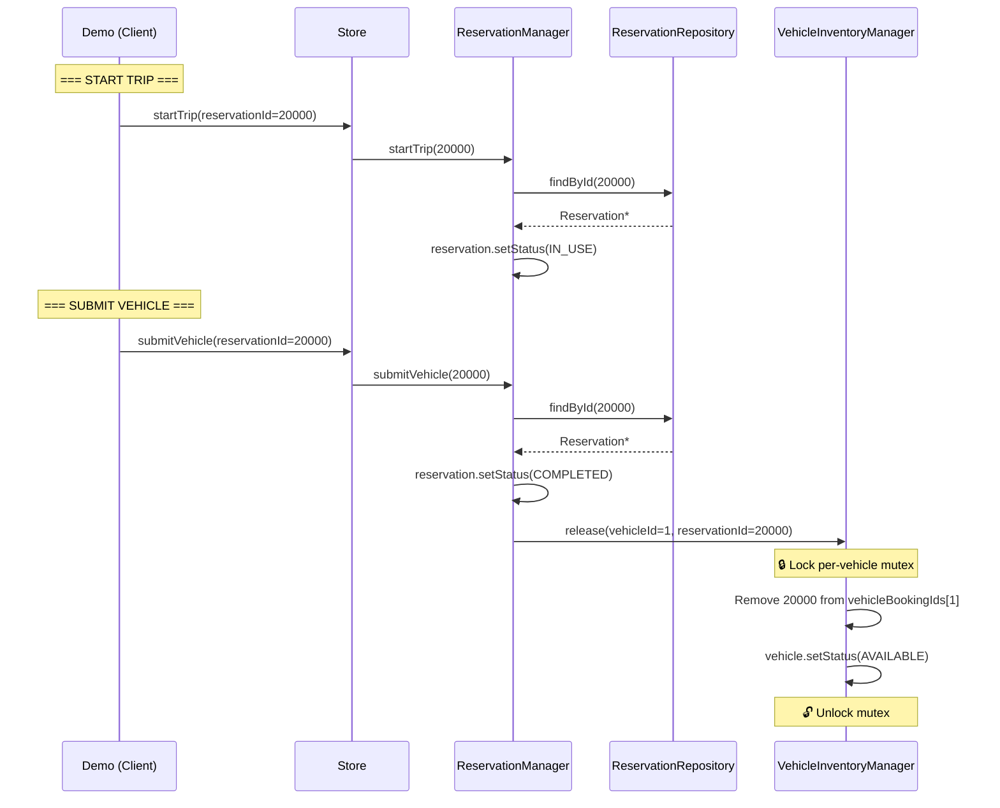
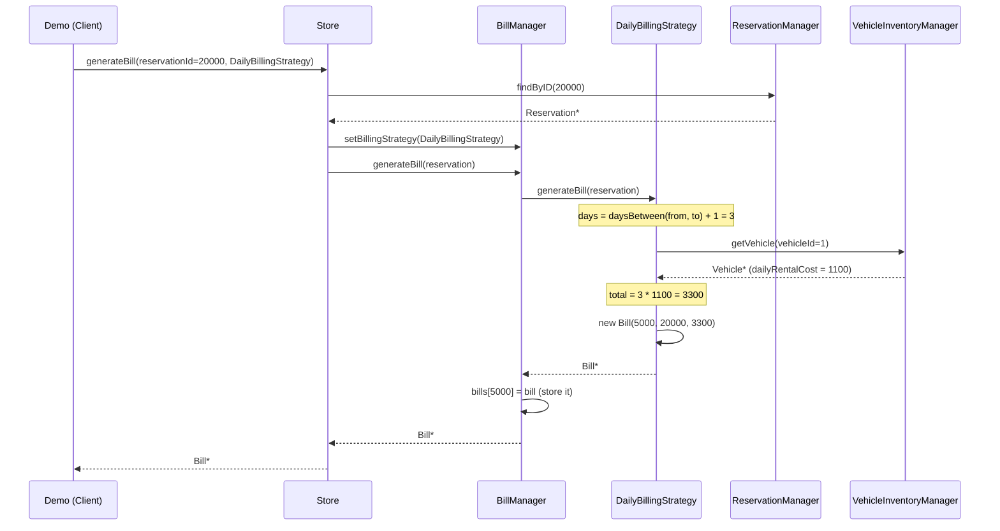
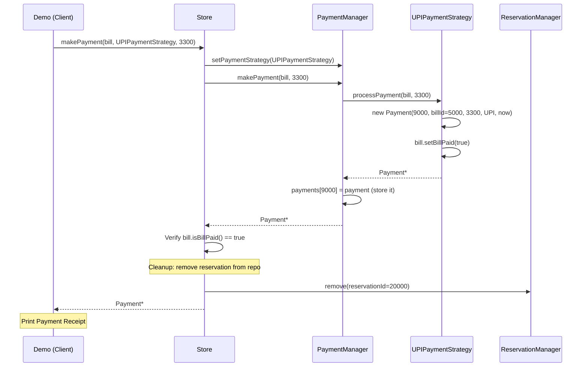

# Car Rental System - Sequence Diagram (Complete Flow)

## Flow 1: Search Available Vehicles

## Flow 2: Create Reservation

## Flow 3: Start Trip & Submit Vehicle

## Flow 4: Generate Bill

## Flow 5: Make Payment

